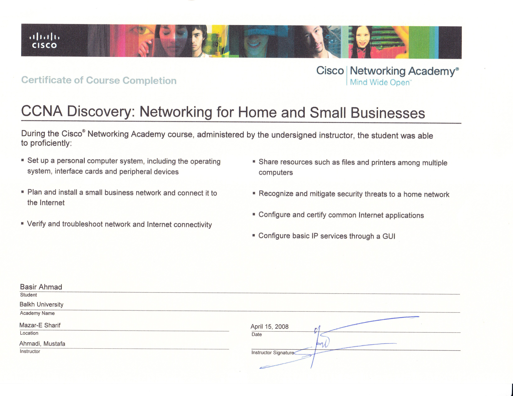

# CCNA Discovery — Networking for Home and Small Businesses

## 🏫 Provider
Cisco Networking Academy

## 🌐 Skills Covered
- Networking fundamentals
- IP addressing
- Routing concepts
- Network devices and topology
- Small business network design
- Troubleshooting basics

## 📝 Description
Completed networking training focused on designing, configuring, and troubleshooting small network environments.

This certification supports roles in networking, IT support, infrastructure operations, and cybersecurity foundations.

## 📄 Certificate Preview

