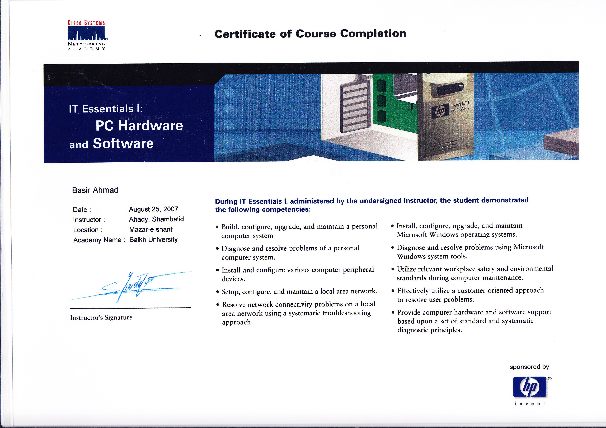
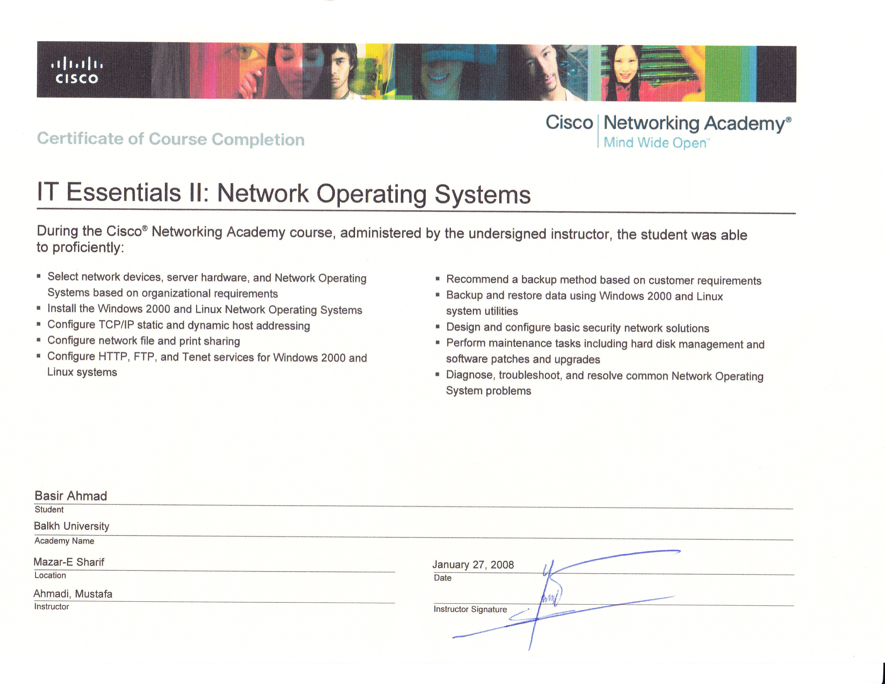

# IT Essentials — Cisco Networking Academy

## Provider
Cisco Networking Academy

## Skills Covered
- Computer hardware and software
- Operating systems
- Networking fundamentals
- Troubleshooting
- Security basics

## Description
Completed foundational IT training covering computer systems, networking basics, and technical troubleshooting.

Relevant for IT Support, Help Desk, and entry-level technical roles.

## 📄 Certificate Preview

