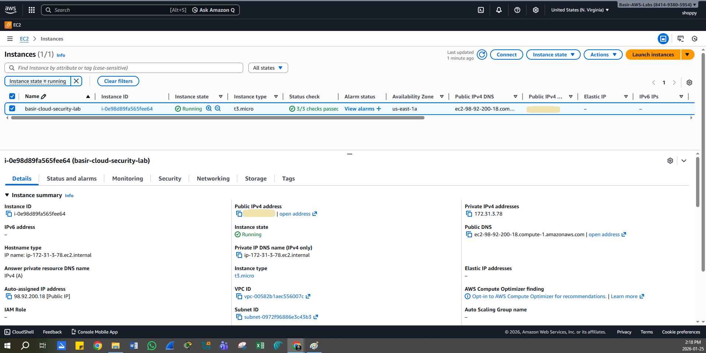
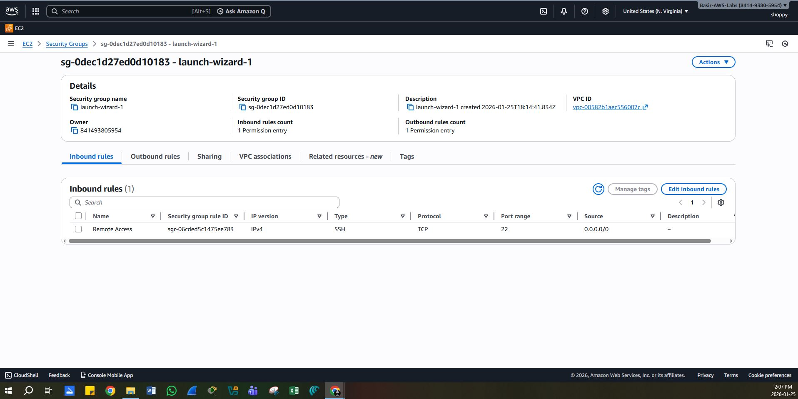
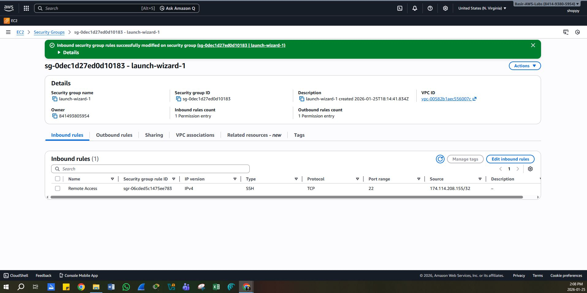
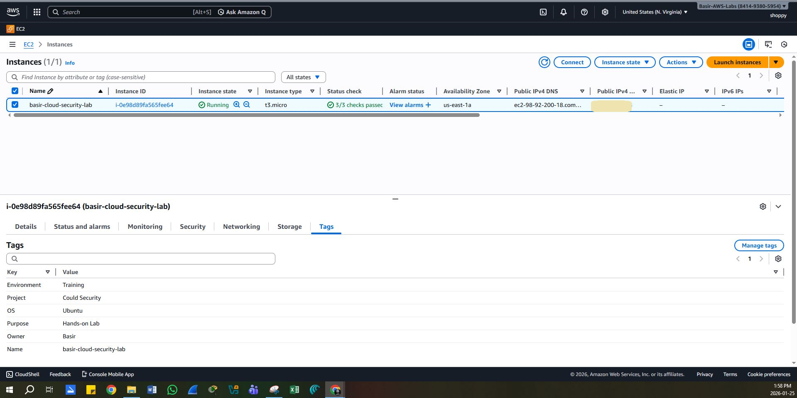

# AWS EC2 Security Group Hardening Lab

## Platform
Amazon Web Services (AWS)

## Lab Overview
This hands-on lab focuses on deploying a basic EC2 instance and applying **network-level security hardening** using AWS Security Groups.  
The goal was to reduce unnecessary exposure by applying **least-privilege access** to inbound network traffic.

This lab reflects real-world cloud security decisions commonly encountered in **Cloud Support**, **SOC**, and **entry-level cloud security** roles.

---

## Environment Details
- **Service:** Amazon EC2
- **Instance Type:** t3.micro
- **Operating System:** Ubuntu Linux
- **Region:** us-east-1
- **Network Control:** AWS Security Groups

---

## Initial Configuration (Insecure State)
- EC2 instance launched with a public IPv4 address
- Security Group inbound rule:
  - **SSH (TCP 22)**
  - **Source:** 0.0.0.0/0 (open to the internet)

### Security Risk Identified
- Exposed SSH service increases risk of:
  - Brute-force attacks
  - Unauthorized access attempts
  - Internet-wide scanning and exploitation

---

## Security Hardening Actions Performed
- Modified Security Group inbound rules:
  - Restricted **SSH (TCP 22)** access
  - Allowed SSH **only from my trusted public IP**
- Removed unrestricted public access
- Verified changes applied successfully

---

## Final Secure Configuration
- SSH access limited to a single trusted IP (`/32`)
- Reduced external attack surface
- Applied least-privilege network access principles

---

## Key Security Concepts Demonstrated
- Cloud network security fundamentals
- Security Group rule evaluation
- Least privilege access
- Exposure reduction
- Understanding cloud misconfigurations

---

## SOC & Cloud Relevance
This lab demonstrates:
- Awareness of common cloud security risks
- Ability to identify insecure defaults
- Practical remediation of network exposure
- Security-focused decision making in cloud environments

Relevant to roles such as:
- Cloud Support / Cloud Operations
- Junior Cloud Security roles
- SOC Analyst with cloud exposure

---

## Evidence & Screenshots

### 1️⃣ EC2 Instance Running
Confirms the EC2 instance was successfully deployed and operational in AWS.

---

### 2️⃣ Security Group – Before Hardening (SSH Open to Internet)
Shows insecure default configuration with SSH (TCP 22) exposed to all IP addresses.

---

### 3️⃣ Security Group – After Hardening (SSH Restricted)
Demonstrates least-privilege access by restricting SSH to a trusted IP only.

---

### 4️⃣ Instance Tags for Identification
Illustrates resource tagging for environment clarity and asset management.

