# Lab 02 – NTP Time Synchronization (Cisco Packet Tracer)

## Objective
Design and configure a secure Network Time Protocol (NTP) infrastructure including authentication, hierarchical synchronization, and time validation across routers.

---

## 🖥️ Network Topology

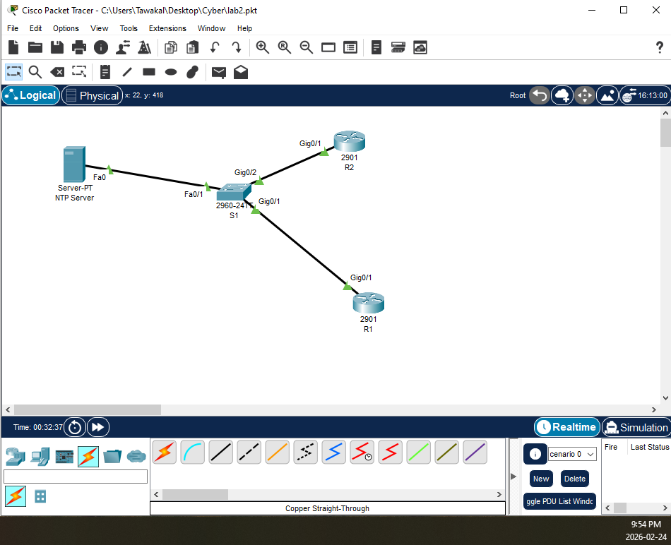

---

## 🔧 Initial IP Configuration (R1)

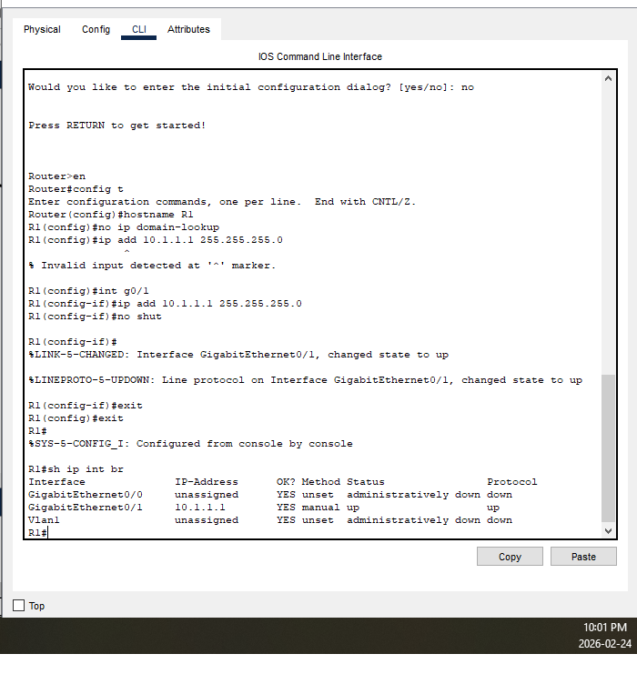

---

## ⏱️ NTP Server Configuration

Configured NTP server with authentication key.

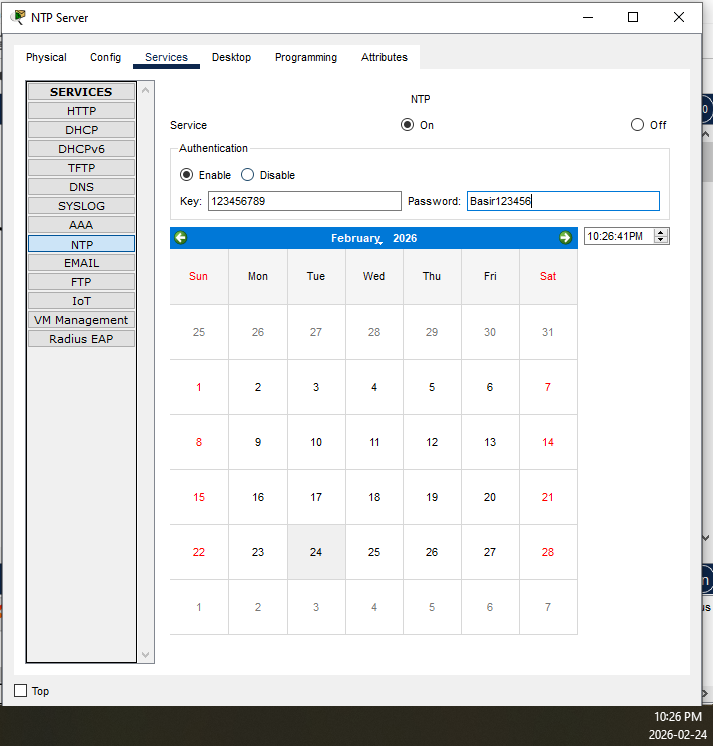

---

## 🔐 R1 as NTP Client (Authenticated)

R1 configured to synchronize with NTP server using authentication.

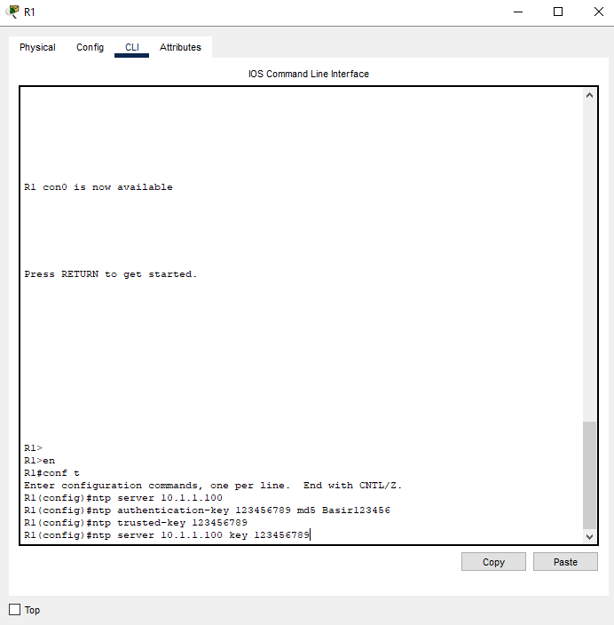

---

## ✅ NTP Synchronization Status

Verification using:

```
show ntp status
show clock
```

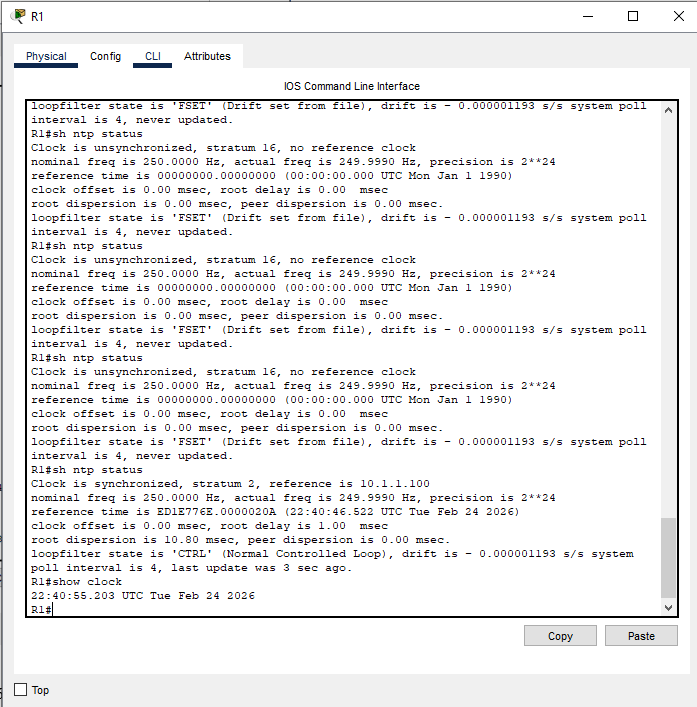

---

## ⚠️ Clock Drift Demonstration

After modifying the NTP server time, synchronization mismatch is observed.

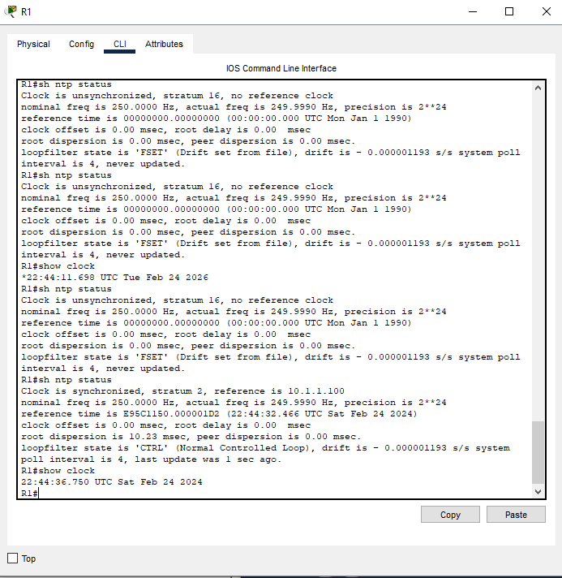

---

## 🏢 R1 as NTP Master

Enabled R1 to act as NTP master for internal devices.

Command used:

```
ntp master
```

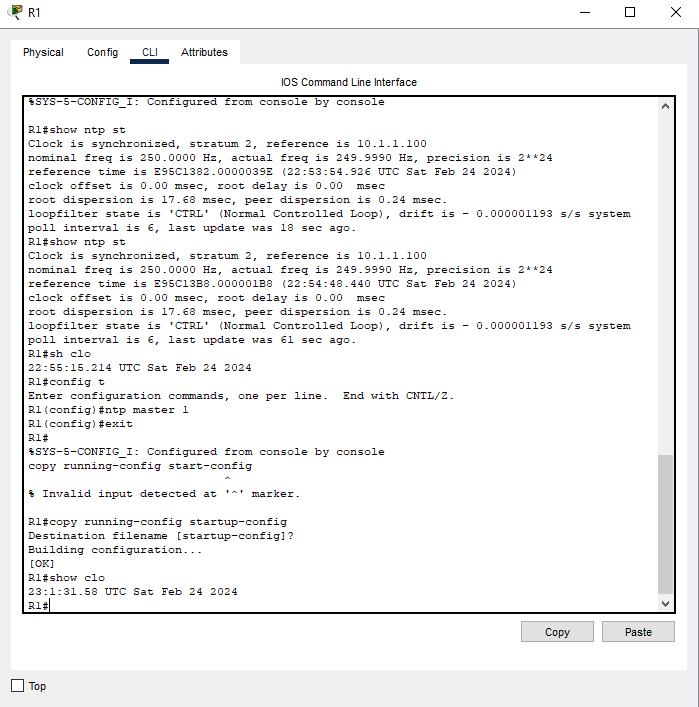

---

## 🌐 R2 Synchronizing from R1

R2 configured as NTP client without authentication.

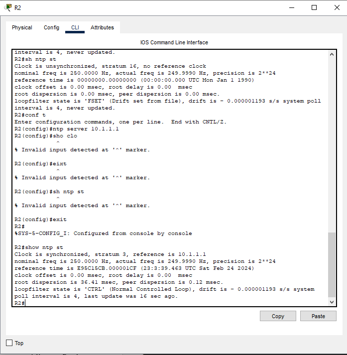

---

## 🕒 Manual Time Override (Test)

Manually set time:

```
clock set 11:45:00 15 March 2020
```

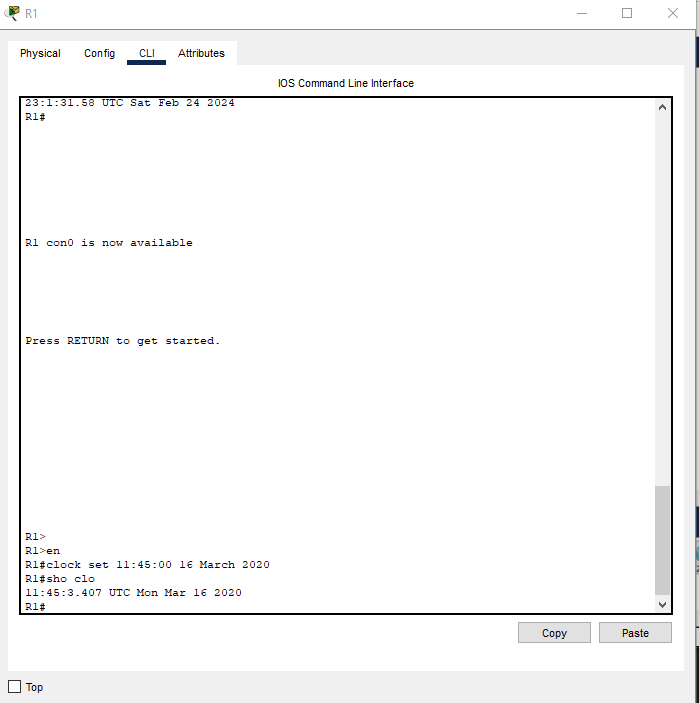

---

## 🌎 Timezone Configuration

Command:

```
clock timezone PST -8
```

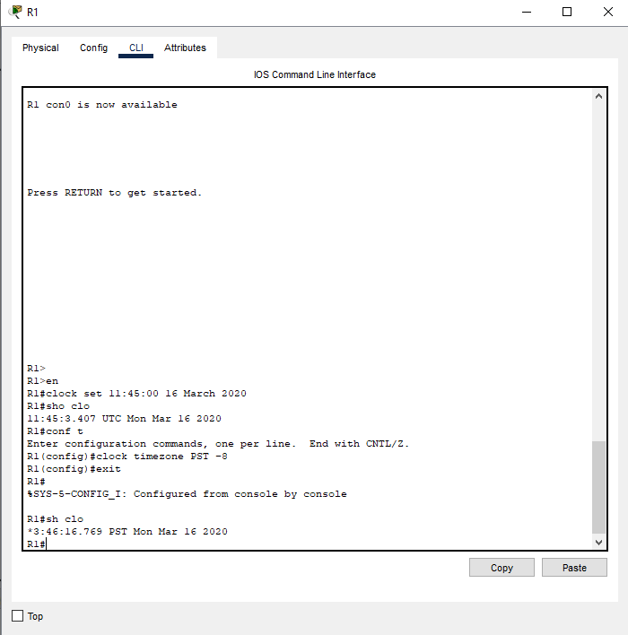

---

## 🔁 Synchronization Impact on R2

Observed how changes on R1 affected downstream synchronization.

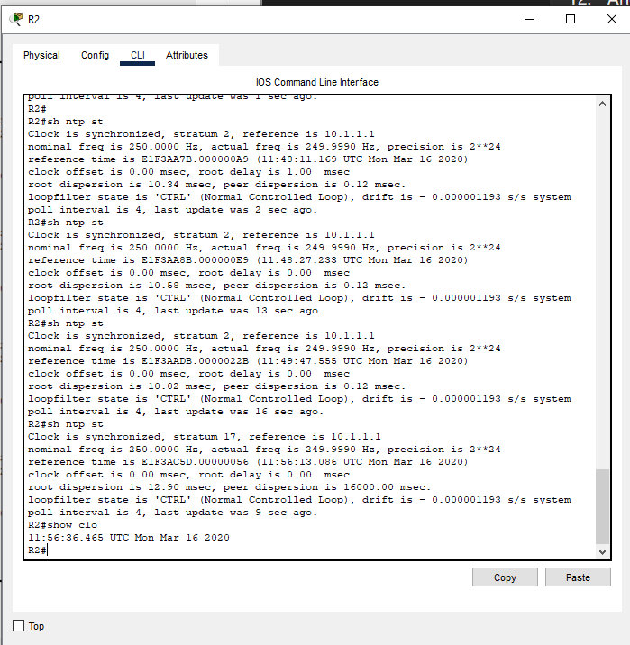

---

## 🔎 Key Cybersecurity Takeaways

- Accurate timestamps are critical for SIEM and log correlation
- Time synchronization prevents forensic timeline inconsistencies
- NTP authentication mitigates rogue time server attacks
- Hierarchical NTP design improves internal network reliability
- Manual clock changes are overridden once synchronization resumes

---

## 🎯 Skills Demonstrated

- Cisco Router CLI configuration
- NTP authentication
- Network hierarchy implementation
- Log accuracy validation
- Operational time integrity management
