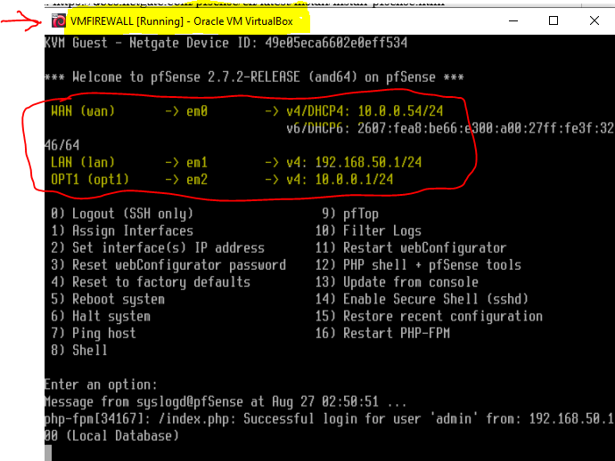
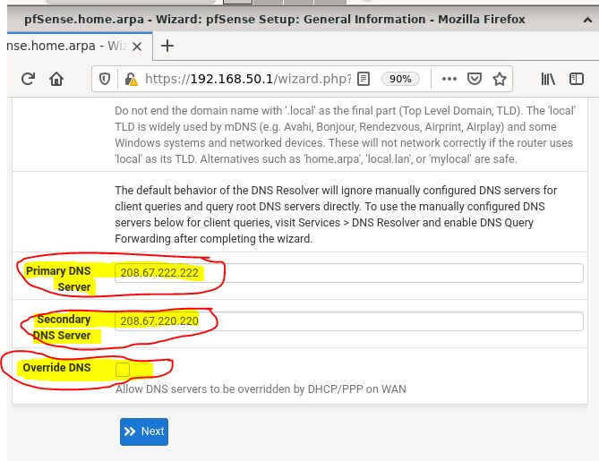
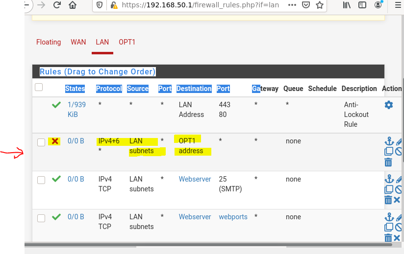
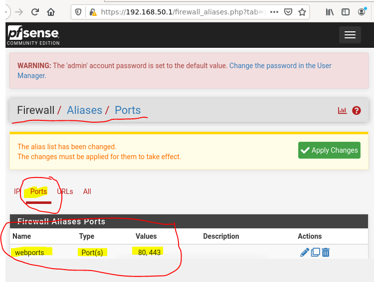
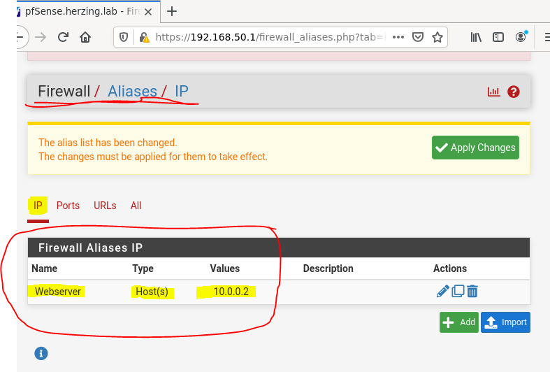
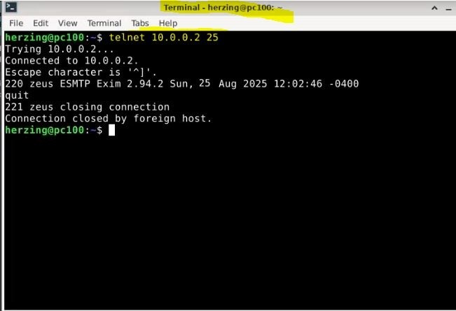
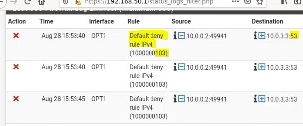

# Lab 4 – Configuring pfSense Firewall

## Overview
This lab focuses on configuring a pfSense firewall to control traffic between WAN, LAN, and DMZ networks. The objective was to implement firewall rules, aliases, logging, and network segmentation, then validate access using practical tests.

## Environment & Tools
- pfSense Firewall
- Virtualized Lab Environment
- LAN, WAN, and DMZ (OPT1) Interfaces
- Telnet for connectivity testing

## Network Interfaces
| Interface | Purpose |
|-----------|---------|
| WAN | External / Internet-facing interface |
| LAN | Internal trusted network |
| OPT1 (DMZ) | Semi-trusted network for services |

## Lab Objectives
- Configure firewall rules for LAN, WAN, and DMZ
- Create and use firewall aliases
- Enable logging on firewall rules
- Test allowed and blocked traffic
- Analyze firewall logs

## Firewall Rules Summary
- Allowed LAN users to access web services using alias-based rules
- Allowed DNS traffic using UDP port 53
- Blocked LAN-to-DMZ access and enabled logging
- Enforced default deny behavior on WAN

## Testing & Verification
Connectivity tests were performed using `telnet` to verify allowed and blocked ports. Firewall logs were reviewed to confirm rule enforcement and traffic behavior.

## Evidence (Screenshots)

### 1. Interface Configuration
Shows WAN, LAN, and OPT1 (DMZ) interfaces and assigned IP addresses.

---

### 2. DNS and Domain Configuration
pfSense hostname, domain, and DNS server configuration.

---

### 3. WAN Security Settings
WAN interface security options including RFC1918 and bogon network blocking.

---

### 4. LAN Firewall Rules
Firewall rules applied on the LAN interface, including allow and block rules.

---

### 5. Firewall Aliases
Aliases used to simplify firewall rule management.

**Port Alias (Web Ports):**

**Host Alias (Web Server):**

---

### 6. Connectivity Test (Allowed Traffic)
Telnet test confirming allowed SMTP traffic to the web server.

---

### 7. Firewall Logs (Blocked Traffic)
Firewall logs showing blocked traffic enforced by the default deny rule.

## Skills Demonstrated
- Firewall rule design and troubleshooting
- Network segmentation (LAN, WAN, DMZ)
- pfSense administration
- Security logging and analysis
- Network testing and validation

## Results
- ✅ LAN to WAN web access permitted
- ✅ DNS traffic allowed and logged correctly
- ✅ LAN to DMZ traffic blocked and logged
- ✅ Firewall rules applied in correct order

## What I Learned
- Learned how pfSense evaluates firewall rules from top to bottom
- Gained hands-on experience creating and applying firewall aliases
- Understood the importance of rule logging for troubleshooting
- Validated firewall behavior using real network traffic tests
- Improved understanding of network segmentation using LAN and DMZ
``
