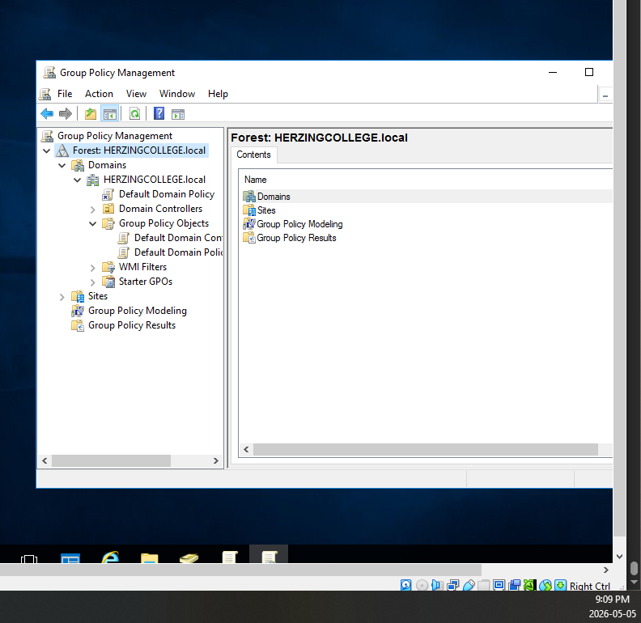
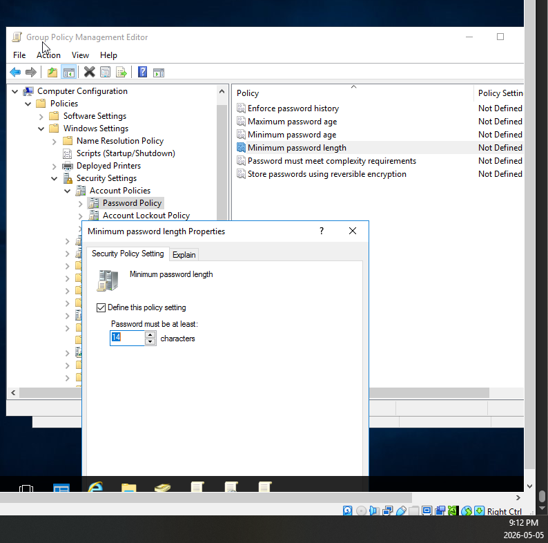
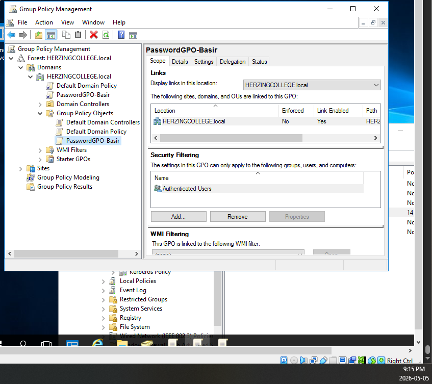
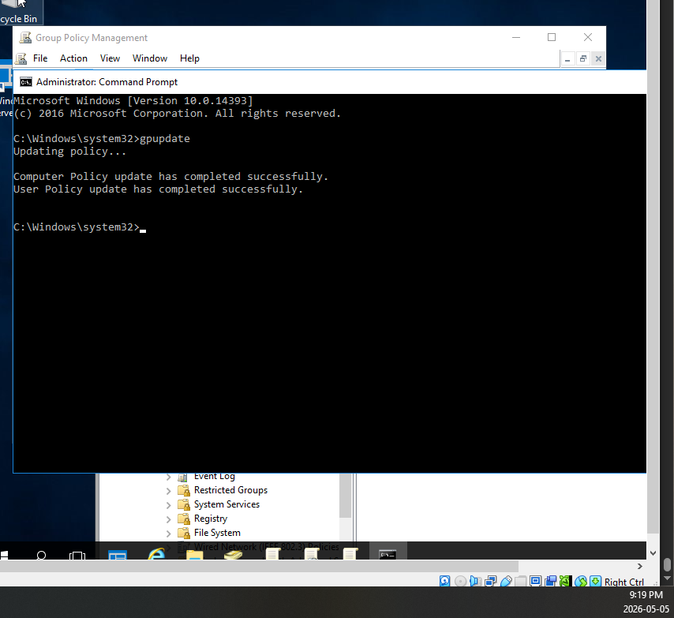

# Windows Security – Local and Group Policies

## Overview
This lab focused on Windows Local Policies and Active Directory Group Policy Objects (GPOs).

## Skills Demonstrated
- Local Security Policy management
- Group Policy Object (GPO) configuration
- Password policy enforcement
- Administrative security settings
- PowerShell GPO updates

## Tools & Technologies
- Windows Server 2016 Essentials
- Group Policy Management Console (GPMC)
- Local Group Policy Editor (gpedit.msc)
- PowerShell

## Key Tasks Completed
- Reviewed local security policies
- Configured password policy requirements
- Created custom GPOs
- Linked GPOs to domain
- Enforced 14-character password policy
- Applied GPO updates using gpupdate
- Tested password enforcement behavior

## Learning Outcome
This lab provided hands-on experience managing enterprise Windows security policies and understanding how Active Directory Group Policies enforce organizational security standards.

## Screenshots

### GPO Management Console

### Password Policy Configuration

### gpupdate Command

### gpupdate Command Line

